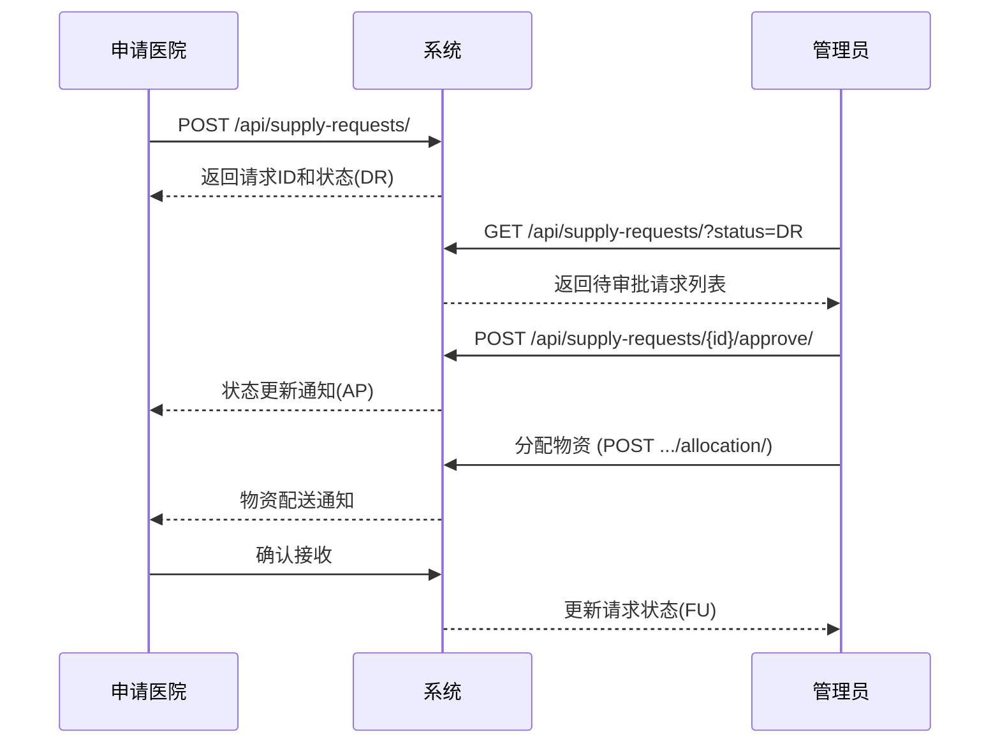
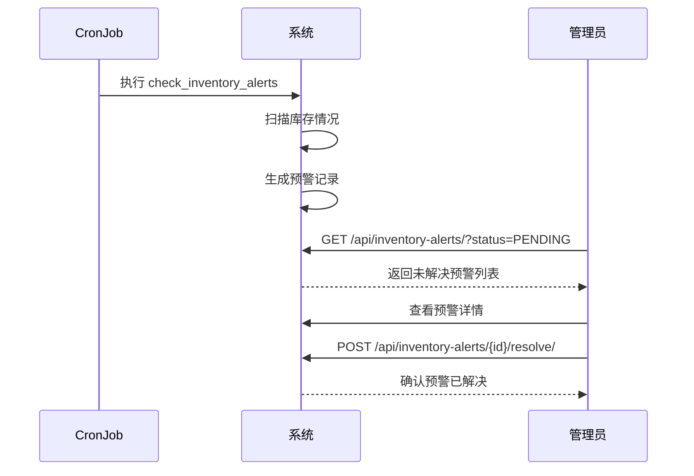

# 医疗物资智慧管理平台 - 后端技术详解

## 1. 项目概述

本项目是“医疗物资智慧管理平台”的后端服务，采用 Python 的 Django 框架及 Django REST Framework (DRF) 构建，旨在提供一套稳定、高效、可扩展的 RESTful API 接口，支撑前端应用实现对医疗物资的全面管理，包括机构管理、物资管理、库存管理、流程管理、预警监控及数据可视化等功能。

## 2. 平台技术架构

- **后端框架:** Django
  - 入口：`manage.py`
  - 配置：`config/settings.py` 中 `INSTALLED_APPS` 包含 `'api'`, `'rest_framework'`, `'django_filters'`, `'corsheaders'`, `'django.contrib.gis'` 等；`DATABASES` (MySQL + GIS)；`REST_FRAMEWORK`（认证、分页、过滤器）；`CORS_ORIGIN_ALLOW_ALL`。
- **路由:**
  - 根路由：`config/urls.py` 注册 `api/urls.py`
  - API 路由：`api/urls.py` 使用 DRF `DefaultRouter` 挂载各资源  ViewSet  及自定义 action。
- **中间件:**
  - CORS：`corsheaders.middleware.CorsMiddleware`
  - 其他：Django 默认安全、会话、认证中间件
- **异步/定时任务:**
  - Management Command：`api/management/commands/check_inventory_alerts.py`
  - 可扩展为 Celery 或 Django Q
- **认证:**
  - 基于 Token 的认证，由 `api.views.CustomAuthToken` 提供登录接口

## 3. 功能组件设计

项目核心功能集中在 `api/` 应用：

### 3.1 机构管理

- Hospital (api.models.Hospital)
  - 字段：`hospital_id`、`name`、`level`、`region`、`address`、`contact_person`、`contact_phone`、`location(PointField)`、`created_at`、`updated_at`、`is_deleted`
- Supplier (api.models.Supplier)
  - 字段：`supplier_id`、`name`、`contact_info` (JSON)、`created_at`、`updated_at`

### 3.2 物资管理

- MedicalSupply (api.models.MedicalSupply)
  - 字段：`unspsc_code`、`name`、`category`、`unit`、`description`、`avg_price`、`min_stock_level`、`created_at`、`updated_at`
- InventoryBatch (api.models.InventoryBatch)
  - 字段：`batch_id`、`batch_number`、`supply`(FK)、`hospital`(FK)、`supplier`(FK)、`quantity`、`unit_price`、`production_date`、`expiration_date`、`received_by`(FK User)、`received_at`、`created_at`、`updated_at`

### 3.3 流程管理

- SupplyRequest (api.models.SupplyRequest)
  - 字段：`request_id`、`requester`(FK User)、`hospital`(FK)、`status`、`priority`、`emergency`、`required_by`、`approver`(FK User)、`approval_time`、`comments`、`created_at`、`updated_at`
- RequestItem (api.models.RequestItem)
  - 字段：`item_id`、`request`(FK SupplyRequest)`items`、`supply`(FK MedicalSupply)、`quantity`、`delivered_qty`、`notes`、`created_at`、`updated_at`
- ItemFulfillment (api.models.ItemFulfillment)
  - 字段：`fulfillment_id`、`item`(FK RequestItem)、`batch`(FK InventoryBatch)、`quantity`、`fulfilled_at`

### 3.4 预警与监控

- InventoryAlert (api.models.InventoryAlert)
  - 字段：`alert_id`、`batch`(FK 可空)、`hospital`(FK 可空)、`alert_type`(LOW/EXP/OVR)、`message`、`status`(PENDING/RESOLVED)、`created_at`、`resolved_at`
- 定时扫描：Management Command 定期生成预警记录

## 4. 数据模型关系

### 4.1 关系概述

- InventoryBatch → MedicalSupply、Hospital、Supplier (多对一)
- SupplyRequest → Hospital、User(requester/approver) (多对一)
- SupplyRequest.items → RequestItem (一对多)
- RequestItem → MedicalSupply (多对一)
- ItemFulfillment → RequestItem、InventoryBatch (多对一)
- InventoryAlert → InventoryBatch/Hospital (多对一)

### 4.2 主要模型字段映射

前端模型接口与后端模型严格对应，共享相同的主键/外键关系：

| 前端接口       | 后端模型       | 主键/标识符 | 关联字段                      |
| -------------- | -------------- | ----------- | ----------------------------- |
| Hospital       | Hospital       | hospital_id | -                             |
| MedicalSupply  | MedicalSupply  | unspsc_code | -                             |
| InventoryBatch | InventoryBatch | batch_id    | supply, hospital, supplier    |
| SupplyRequest  | SupplyRequest  | request_id  | hospital, requester, approver |
| RequestItem    | RequestItem    | item_id     | request, supply               |
| InventoryAlert | InventoryAlert | alert_id    | batch, hospital               |

### 4.3 数据库 ER 图示

[此处可插入数据库 ER 图]

## 5. 序列化与视图

- Serializer：基础/完整/嵌套序列化器（HospitalSerializer、MedicalSupplySerializer、InventoryBatchSerializer、SupplyRequestSerializer 等）
- ViewSet：继承 `ModelViewSet`，支持 CRUD + 自定义 action (`approve`、`reject`、`resolve`)
- 过滤与分页：DRF 全局 `PageNumberPagination` + `django-filter`
- Dashboard：函数视图提供 `/api/dashboard/*` 系列统计接口

## 6. 与前端对接说明

### 6.1 认证机制

本项目采用基于 Token 的认证机制，遵循以下流程：

1. 前端调用 `/api/auth/token/` 获取用户 Token
2. 所有 API 请求头部增加 `Authorization: Token <token值>`
3. Token 过期或无效时，返回 401 状态码
4. 前端捕获 401 后自动跳转登录页

### 6.2 CORS 配置

后端已通过 `django-cors-headers` 配置允许跨域请求：

- `CORS_ORIGIN_ALLOW_ALL = True` (开发环境)
- 生产环境应配置 `CORS_ALLOWED_ORIGINS` 限定前端域名

### 6.3 GIS 数据格式

对于医院地理位置数据，提供标准 GeoJSON 格式：

```json
{
	"type": "FeatureCollection",
	"features": [
		{
			"type": "Feature",
			"properties": {
				"hospital_id": "H001",
				"name": "武汉协和医院",
				"level": 3
			},
			"geometry": {
				"type": "Point",
				"coordinates": [114.282375, 30.590275]
			}
		}
	]
}
```

## 7. 前后端交互

- 数据格式：JSON
- 认证：POST `/api/auth/token/` 获取 Token；Header 携带 `Authorization: Token <token>`
- 核心端点示例：
  - GET `/api/hospitals/`
  - POST `/api/supply-requests/`
  - POST `/api/supply-requests/{id}/approve/`
  - GET `/api/inventory-alerts/?status=PENDING`
  - GET `/api/dashboard/supplies-overview/`

### 7.1 API 接口详细清单

| 模块 | 端点                                  | 方法 | 参数                             | 说明             |
| ---- | ------------------------------------- | ---- | -------------------------------- | ---------------- |
| 认证 | `/api/auth/token/`                    | POST | `username`, `password`           | 登录获取 Token   |
| 医院 | `/api/hospitals/`                     | GET  | 可选: `name`, `region`, `level`  | 获取医院列表     |
| 医院 | `/api/hospitals/{id}/`                | GET  | -                                | 获取单个医院详情 |
| 物资 | `/api/supplies/`                      | GET  | 可选: `category`                 | 获取物资列表     |
| 物资 | `/api/supplies/{code}/`               | GET  | -                                | 获取物资详情     |
| 库存 | `/api/inventory-batches/`             | GET  | 可选: `hospital_id`, `supply_id` | 获取库存批次     |
| 请求 | `/api/supply-requests/`               | POST | 详见示例                         | 创建物资请求     |
| 请求 | `/api/supply-requests/{id}/approve/`  | POST | 可选: `comments`                 | 审批请求         |
| 请求 | `/api/supply-requests/{id}/reject/`   | POST | 必选: `comments`                 | 拒绝请求         |
| 预警 | `/api/inventory-alerts/{id}/resolve/` | POST | 可选: `resolution_notes`         | 解决预警         |
| 统计 | `/api/dashboard/hospitals-map/`       | GET  | -                                | 医院地理分布数据 |
| 统计 | `/api/dashboard/inventory-overview/`  | GET  | -                                | 库存总览数据     |
| 统计 | `/api/dashboard/request-status/`      | GET  | -                                | 请求状态分布     |
| 统计 | `/api/dashboard/alert-trends/`        | GET  | 可选: `days`                     | 预警趋势数据     |

### 7.2 请求响应示例

#### 1. 用户登录

```json
// 请求 POST /api/auth/token/
{
  "username": "admin",
  "password": "password123"
}

// 响应 200 OK
{
  "token": "9944b09199c62bcf9418ad846dd0e4bbdfc6ee4b",
  "user": {
    "id": 1,
    "username": "admin",
    "email": "admin@example.com",
    "role": "admin"
  }
}
```

#### 2. 创建物资请求

```json
// 请求 POST /api/supply-requests/
{
  "hospital": "H001",
  "priority": "HIGH",
  "emergency": false,
  "required_by": "2023-07-30",
  "comments": "Emergency supplies needed for surgery department",
  "items": [
    {
      "supply": "42141700",
      "quantity": 50,
      "notes": "Surgical masks"
    },
    {
      "supply": "42281600",
      "quantity": 20,
      "notes": "Patient monitors"
    }
  ]
}

// 响应 201 Created
{
  "request_id": "REQ20230715001",
  "status": "DR",
  "created_at": "2023-07-15T10:32:45Z",
  "items": [
    {
      "item_id": "ITEM001",
      "supply": "42141700",
      "quantity": 50
    },
    {
      "item_id": "ITEM002",
      "supply": "42281600",
      "quantity": 20
    }
  ]
}
```

## 8. 功能展示流程

1. 登录 → 获取 Token
2. 加载下拉：GET `/api/hospitals/`、`/api/suppliers/`
3. 查看库存：GET `/api/inventory-batches/?hospital_id=…`
4. 提交请求：POST `/api/supply-requests/` + items 列表
5. 审批：POST `/api/supply-requests/{id}/approve/` 或 `/reject/`
6. 查看预警：GET `/api/inventory-alerts/`
7. 大屏展示：定时轮询 `/api/dashboard/*`

## 9. 业务流程数据流

### 9.1 物资请求与审批流程



### 9.2 库存预警处理流程


