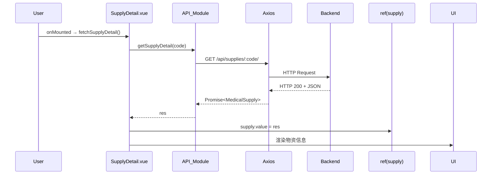
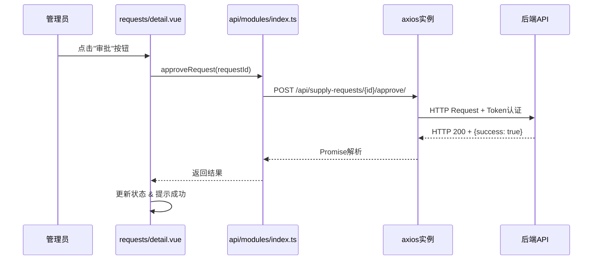

# 武汉市医疗物资管理平台 - 前端

## 1. 项目描述

本项目是武汉市医疗物资管理平台的前端模块，完全前后端分离，基于 Vue 3 + TypeScript。  
它提供：

1. **数据大屏** ([`src/views/index/index.vue`](src/views/index/index.vue))
2. **后台管理** ([`src/views/HomeView.vue`](src/views/HomeView.vue))

通过 Pinia、Axios、Element Plus、ECharts、百度地图等技术栈，构建高效可维护的 UI 与数据流。

## 2. 技术栈

- Vue 3 组合式 API + TypeScript
- Vite ([`vite.config.ts`](vite.config.ts))
- Pinia 状态管理
- Vue Router 路由 ([`src/router/index.ts`](src/router/index.ts))
- Element Plus 组件库
- ECharts ([`src/plugins/echarts.ts`](src/plugins/echarts.ts))
- 百度地图 GL 版 ([`index.html`](index.html))
- Tailwind CSS + Sass/SCSS
- Axios ([`src/api/api.ts`](src/api/api.ts))
- Day.js、JSON5

### 2.1 技术栈与后端对接细节

- **Axios 配置**：封装了统一的错误处理、Token 注入等逻辑，配置见 [api.ts](http://_vscodecontentref_/0)
  - 认证头: `Authorization: Token <token>` (匹配 Django REST framework 认证方式)
  - 请求拦截器：自动添加 Token
  - 响应拦截器：处理 401/403 等认证错误
- **GIS 相关**：配合后端的`django.contrib.gis`和`PointField`
  - 百度地图 GL 集成：加载医院位置点位
  - 地理编码与坐标转换工具：`src/utils/map.ts`

## 3. 项目结构

```
.
├── public/
├── src/
│   ├── api/           # Axios 封装 & 各模块接口 ([`src/api/api.ts`](src/api/api.ts), [`src/api/modules/index.ts`](src/api/modules/index.ts))
│   ├── assets/        # 全局样式、图片
│   ├── components/    # 公共组件 (`ItemWrap`, `CountUp`, ...)
│   ├── config/        # 常量/环境变量读取 ([`src/config/UtilVar.ts`](src/config/UtilVar.ts))
│   ├── enums/         # TypeScript 枚举
│   ├── plugins/       # 第三方插件初始化
│   ├── router/        # 路由定义 & 守卫 ([`src/router/index.ts`](src/router/index.ts))
│   ├── stores/        # Pinia 模块 ([`auth.ts`](src/stores/auth.ts), [`setting.ts`](src/stores/setting/setting.ts), ...)
│   ├── types/         # 业务类型 ([`models.d.ts`](src/types/models.d.ts))
│   ├── utils/         # 工具函数 (`storage.ts`, `format.ts`, ...)
│   └── views/         # 页面视图
│       ├── index/     # 数据大屏
│       ├── dashboard/ # 仪表盘
│       ├── analysis/  # 数据分析
│       ├── hospitals/ # 医院管理（列表/详情）
│       ├── inventory/ # 库存管理（列表/详情）
│       ├── supplies/  # 物资管理（列表/详情）
│       ├── suppliers/ # 供应商管理（列表/抽屉详情）
│       ├── requests/  # 物资调度（列表/详情）
│       ├── alerts/    # 预警管理（列表/详情）
│       ├── Login.vue  # 登录页
│       └── HomeView.vue # 后台布局
├── .env.*             # 环境变量
├── index.html         # 应用入口
├── package.json       # npm 脚本 & 依赖
├── tsconfig.json
└── README.md
```

## 4. 前端核心设计

### 4.1 路由设计

- `/login` — 登录页
- `/` — 数据大屏
- `/management` — 后台主布局
  - `/management/dashboard` — 仪表盘 ([`src/views/dashboard/index.vue`](src/views/dashboard/index.vue))
  - `/management/analysis` — 数据分析 ([`src/views/analysis/index.vue`](src/views/analysis/index.vue))
  - `/management/hospitals` — 医院列表
  - `/management/hospitals/:id` — 医院详情
  - `/management/inventory` — 库存列表
  - `/management/inventory/:id` — 库存详情
  - `/management/supplies` — 物资列表
  - `/management/supplies/:code` — 物资详情
  - `/management/suppliers` — 供应商列表
  - `/management/requests` — 物资调度列表
  - `/management/requests/:id` — 调度详情
  - `/management/alerts` — 预警列表
  - `/management/alerts/:id` — 预警详情

路由守卫位于 [`src/router/index.ts`](src/router/index.ts)，根据 `meta.requiresAuth`、`meta.requiresAdmin` 判断权限并重定向。

### 4.2 Pinia 模块

1. **Auth Store** ([`src/stores/auth.ts`](src/stores/auth.ts))
   - state: `token`, `user`, `userRole`
   - actions: `login()`, `logout()`, `fetchUser()`
2. **Setting Store** ([`src/stores/setting/setting.ts`](src/stores/setting/setting.ts))
   - 全屏数据大屏配置：刷新间隔、滚动方向等
3. **其它可选 Store**（可按业务拆分）

### 4.3 组件通信与数据流

- **父子/兄弟**：`props` + `emits` & `$refs`
- **全局共用**：Pinia
- **跨页路由**：`router.push({ path, query })`
- **数据更新**：onMounted → 调用 API → 更新 `ref`/`reactive` → 界面响应式渲染
- **错误/提示**：`ElMessage`, `ElMessageBox`

### 4.4 前端类型定义与后端模型映射

前端的类型定义位于 [`src/types/models.d.ts`](src/types/models.d.ts)，与后端数据模型保持一致：

| 前端接口         | 后端模型         | 说明                                        |
| ---------------- | ---------------- | ------------------------------------------- |
| `Hospital`       | `Hospital`       | 包含 hospital_id, name, level 等字段        |
| `Supplier`       | `Supplier`       | 供应商信息，contact_info 为 JSON 字段       |
| `MedicalSupply`  | `MedicalSupply`  | 物资基本信息，使用 unspsc_code 作为唯一标识 |
| `InventoryBatch` | `InventoryBatch` | 库存批次，关联医院、物资和供应商            |
| `SupplyRequest`  | `SupplyRequest`  | 物资请求，包含状态、优先级等信息            |
| `RequestItem`    | `RequestItem`    | 请求中的具体物资项                          |
| `InventoryAlert` | `InventoryAlert` | 库存预警信息                                |

---

## 5. 主要功能模块详解

### 5.1 数据大屏 (`src/views/index`)

- **`index.vue`**
  - 管理整体布局：左右中三列 Flex/Grid
  - `watch` `settingStore.openWatch` 触发数据轮询
  - `onMounted` 初始化各图表 & 地图
- **左区**
  - [`left-top.vue`](src/views/index/left-top.vue)：`CapsuleChart` 物资占比
  - [`left-center.vue`](src/views/index/left-center.vue)：ECharts 医院等级分布
  - [`left-bottom.vue`](src/views/index/left-bottom.vue)：`SeamlessScroll` 库存预警
- **中区**
  - [`center-map.vue`](src/views/index/center-map.vue)：百度地图点位，`emit('select-hospital', { id, name, coords })`
  - [`center-bottom.vue`](src/views/index/center-bottom.vue)：时间轴/列表展示 `fulfilled_requests` / `pending_requests`
- **右区**
  - [`right-top.vue`](src/views/index/right-top.vue)：医院搜索 & 历史记录，`emit('search', { id, name })`
  - [`right-center.vue`](src/views/index/right-center.vue)：医院详情概览（库存图、预警、最近请求），监听 `props.hospitalId`
  - [`right-bottom.vue`](src/views/index/right-bottom.vue)：物资请求状态图表

### 5.2 后台管理系统 (`src/views/*`)

#### 5.2.1 医院管理

- **列表** ([`index.vue`](src/views/hospitals/index.vue))
  - 搜索表单：医院名、地区、等级
  - 表格：`el-table` + 操作列（查看详情）
  - 分页：`el-pagination`
- **详情** ([`detail.vue`](src/views/hospitals/detail.vue))
  - 基本信息卡片（名称、等级、地址、负责人）
  - 容量信息（当前库存、使用率、阈值 + 进度条）
  - 库存物资分类分布 (`initPieChart()`)
  - 最近未解决预警列表 + 跳转按钮
  - 最近请求列表

#### 5.2.2 库存管理

- **列表** ([`src/views/inventory/index.vue`](src/views/inventory/index.vue))
  - 批次号、所属医院、物资、数量、生产/过期日期（高亮）
  - 搜索：批次号、医院、物资、即将过期
- **详情** ([`src/views/inventory/detail.vue`](src/views/inventory/detail.vue))
  - 基本信息卡片：批次号、数量、生产/过期日期、天数计算 (`calculateDaysRemaining`)、价值计算
  - 医院、物资、供应商关联信息
  - 存储条件 / 备注

#### 5.2.3 物资管理

- **列表** ([`src/views/supplies/index.vue`](src/views/supplies/index.vue))
  - 名称、分类、单位、是否受控、最低库存
- **详情** ([`src/views/supplies/detail.vue`](src/views/supplies/detail.vue))
  - 基本信息卡片：名称、编码、规格、是否受控
  - 库存批次表格 + 分页

#### 5.2.4 供应商管理

- **列表** ([`src/views/suppliers/index.vue`](src/views/suppliers/index.vue))
  - 名称、联系人、电话、创建/更新时间
  - 解析并展示 `contact_info` JSON
- **详情抽屉**：展示更多联系人 & 地址

#### 5.2.5 物资调度

- **列表** ([`src/views/requests/index.vue`](src/views/requests/index.vue))
  - 申请医院、物资类型、数量、状态、优先级排序
  - 分配操作：`startEditAllocation` → `saveItemAllocation` → 调用 [`updateRequestItemAllocation`](src/api/modules/index.ts)
- **详情** ([`src/views/requests/detail.vue`](src/views/requests/detail.vue))
  - 请求基本信息 + 状态标签 (`getStatusType`)
  - 物资清单 & 分配进度 (`allocationRate`)
  - 保存操作批量 `Promise.all(updateRequestItemAllocation)`
  - **请求审批/拒绝功能**：实现对应后端 `/api/supply-requests/{id}/approve/` 或 `/reject/` 接口
  - **物品履行记录**：显示与 `ItemFulfillment` 模型相关的分配记录

#### 5.2.6 预警管理

- **列表** ([`src/views/alerts/index.vue`](src/views/alerts/index.vue))
  - 搜索表单：医院、类型、是否已解决、起止日期
  - 表格 + 分页
- **详情** ([`src/views/alerts/detail.vue`](src/views/alerts/detail.vue))
  - 基本信息 + 解决按钮 (`resolveAlertById`)
  - 跳转医院/物资/批次

### 5.3 与后端特色功能契合点

#### 5.3.1 Django GIS 地理信息集成

前端通过百度地图 GL 组件与后端 Django GIS 功能对接：

- [`center-map.vue`](src/views/index/center-map.vue) 调用 `hospitalsMap()` API
- 后端返回医院 GeoJSON 格式数据 (PointField)
- 前端解析并在地图上展示医院点位

#### 5.3.2 实时预警监控

- 前端定时轮询 `/api/dashboard/*` 系列接口
- [`left-bottom.vue`](src/views/index/left-bottom.vue) 展示 `InventoryAlert` 实时数据
- 预警分类展示：库存不足(LOW)、即将过期(EXP)、库存超量(OVR)

---

## 6. 与后端交互

### 6.1 接口集中定义

| 模块      | 接口常量        | 服务函数                                                                                                                                                                                                                                     |
| --------- | --------------- | -------------------------------------------------------------------------------------------------------------------------------------------------------------------------------------------------------------------------------------------- |
| Auth      | `AUTH_API`      | `login()`, `logout()`                                                                                                                                                                                                                        |
| Hospitals | `HOSPITALS_API` | `getHospitals()`, `getHospitalDetail()`, `hospitalsOverview()`, `hospitalsMap()`, `getHospitalAlerts()`, `getHospitalInventory()`, `getHospitalRequests()`                                                                                   |
| Inventory | `INVENTORY_API` | `getInventoryBatches()`, `getInventoryBatchDetail()`, `inventoryOverview()`                                                                                                                                                                  |
| Supplies  | `SUPPLIES_API`  | `getSupplies()`, `getSupplyDetail()`, `suppliesOverview()`                                                                                                                                                                                   |
| Suppliers | `SUPPLIERS_API` | `getSuppliers()`, `getSupplierDetail()`                                                                                                                                                                                                      |
| Requests  | `REQUESTS_API`  | `getRequestsList()`, `getRequestDetail()`, `createRequest()`, **`approveRequest()`**, **`rejectRequest()`**, `getRequestItemsForAllocation()`, `updateRequestItemAllocation()`, `requestStatus()`, `requestTrends()`, `requestFulfillment()` |
| Alerts    | `ALERTS_API`    | `getInventoryAlertsList()`, `getAlertDetail()`, **`resolveAlertById()`**, `alertTrends()`                                                                                                                                                    |

所有调用集中在 [`src/api/modules/index.ts`](src/api/modules/index.ts)，底层使用封装好的 `GET/POST/PUT/DELETE`([`src/api/api.ts`](src/api/api.ts))。

### 6.2 请求/响应 & 认证

1. **登录** → POST `/api/auth/token/` → 返回 `token` + `user`
2. **全局拦截** ([`src/api/api.ts`](src/api/api.ts))：
   - 请求头自动注入 `Authorization: Token <token>` (而非 Bearer，与后端保持一致)
   - 401/403 统一捕获跳转 `/login`
3. **鉴权路由** (`router.beforeEach`)：
   - 检查 Pinia 中 `authStore.isLoggedIn` & `userRole`
4. **Logout** → 清空 Token & User → 跳转 `/login`

### 6.3 数据流示例

以“物资详情”页为例：



更新物资请求状态示例（匹配后端审批流程）：



### 6.4 API 模块详细结构

[`src/api/api.ts`](src/api/api.ts) 定义了以下 API 端点常量：

```typescript
// 医院相关API
export const HOSPITALS_API = {
	list: "/api/hospitals/",
	detail: (id: string) => `/api/hospitals/${id}/`,
	overview: "/api/dashboard/hospitals-overview/",
	map: "/api/dashboard/hospitals-map/",
};

// 库存相关API
export const INVENTORY_API = {
	batches: "/api/inventory-batches/",
	batchDetail: (id: string) => `/api/inventory-batches/${id}/`,
	overview: "/api/dashboard/inventory-overview/",
};

// 物资请求相关API
export const REQUESTS_API = {
	list: "/api/supply-requests/",
	detail: (id: string) => `/api/supply-requests/${id}/`,
	create: "/api/supply-requests/",
	approve: (id: string) => `/api/supply-requests/${id}/approve/`,
	reject: (id: string) => `/api/supply-requests/${id}/reject/`,
	allocation: "/api/request-items-allocation/",
	updateAllocation: (requestId: string, itemId: string) =>
		`/api/supply-requests/${requestId}/items/${itemId}/allocation/`,
	status: "/api/dashboard/request-status/",
	fulfillment: "/api/dashboard/request-fulfillment/",
	trends: "/api/dashboard/alert-trends/",
};
```

---

## 7. 样式与主题

- 全局主题色：`#00fdfa` (青色)
- 背景统一：深色 `#03050C`
- 容器圆角 & 半透明背景
- 使用 Tailwind CSS + SCSS 按需扩展

---

> **总结**：  
> 本前端部分涵盖数据大屏展示与后台 CRUD 系统。  
> 通过组件化、模块化、状态管理与统一接口，保证高内聚低耦合，可持续迭代与维护。  
> 详细业务逻辑、接口文档可结合后端 API 文档与 [`src/api/modules/index.ts`](src/api/modules/index.ts) 一起审阅。
